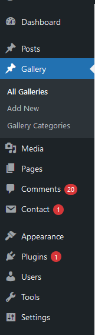
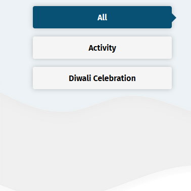

# Devexhub Gallery

Contributors: devexhub  
Donate link: [https://devexhub.com/](https://devexhub.com/)  
Requires PHP: 7.2  
Developed By: Gurjaint Narwal  
Designed by: Akshay Kumar  
Tags: gallery, photo gallery, image gallery, responsive gallery, WordPress gallery, media gallery, gallery plugin, photo album, photo grid, image display, image showcase, image slider, slideshow, media showcase, WordPress media, WordPress plugin  
Requires at least: 3.0.1  
Tested up to: 6.5.2  
Stable tag: 1.8  
License: GPLv2 or later  
License URI: [http://www.gnu.org/licenses/gpl-2.0.html](http://www.gnu.org/licenses/gpl-2.0.html)

Devexhub Gallery is a powerful WordPress plugin that allows you to easily create and manage a beautiful gallery section on your website. This plugin comes with an easy-to-use interface and a range of customizable options that allow you to create a gallery that perfectly matches your website's design.

## Description

Devexhub Gallery is a versatile WordPress plugin designed to help you create stunning and dynamic galleries on your website. With this plugin, you can effortlessly add, organize, and display images in a professional gallery that is fully responsive and customizable.

Key Features:
- **Easy-to-use Interface:** Manage your galleries from the WordPress admin dashboard.
- **Responsive Design:** Ensure your galleries look great on all devices.
- **Customizable Options:** Choose from various layouts and image sizes to match your site's design.
- **SEO Friendly:** Add captions, alt text, and other details to make your images accessible and optimized for search engines.
- **Multiple Display Modes:** Options include lightbox and full-screen modes.
- **Gutenberg Compatible:** Fully supports the WordPress Gutenberg editor.

## Features

1. **User-Friendly Interface:** Easily create and manage galleries in the WordPress admin dashboard.
2. **Fully Responsive:** Galleries look great on desktops, tablets, and smartphones.
3. **Customization Options:** Choose layouts, adjust image sizes, and more.
4. **SEO-Friendly:** Add captions, alt text, and other details to images.
5. **Multiple Display Modes:** Lightbox, full-screen, and other viewing options.
6. **Gutenberg Compatible:** Seamlessly integrate with the WordPress Gutenberg editor.

## Installation

1. Download the Devexhub Gallery plugin from the WordPress plugin repository or the [Devexhub website](https://devexhub.com/).
2. Upload the plugin files to the `/wp-content/plugins/devexhub-gallery` directory, or install the plugin directly from the WordPress plugin repository.
3. Activate the plugin through the 'Plugins' screen in WordPress.
4. Navigate to the Devexhub Gallery section in your WordPress admin dashboard to start creating your gallery.

## Usage

1. Go to the Devexhub Gallery section in your WordPress admin dashboard.
2. Click the 'Add Images' button to upload images to your gallery.
3. Customize your gallery settings, such as layout, image sizes, and captions.
4. Publish your gallery and view it on the frontend of your website.

## Frequently Asked Questions

**Is Devexhub Gallery compatible with my WordPress theme?**  
Yes, Devexhub Gallery is designed to be compatible with a wide range of WordPress themes. If you encounter any issues, please contact the Devexhub support team for assistance.

**Can I use Devexhub Gallery with the Gutenberg editor?**  
Yes, Devexhub Gallery is fully compatible with the WordPress Gutenberg editor.

**How do I add captions or alt text to my gallery images?**  
You can add captions, alt text, and other details to your images when you add them to your gallery in the WordPress admin dashboard.

**Why should I use the Devexhub Gallery plugin?**  
This plugin allows you to create a responsive gallery page on the frontend, making your images look great on all devices.

**Can I add new categories to my galleries?**  
Yes, you can add dynamic categories for gallery pages.

**Can I filter images by category on the gallery page?**  
Yes, the plugin allows you to filter images by categories.

**Is the gallery page responsive on mobile devices?**  
Yes, the gallery page is fully responsive and looks good on both desktop and mobile devices.

## Support

If you need assistance with the Devexhub Gallery plugin, please contact the Devexhub support team at [https://devexhub.com/contact-us](https://devexhub.com/contact-us). We're here to help!

## Screenshots

1. 
2. 

## Changelog

### 1.0
- Initial release.

### 1.5
- Fixed issue with the template for the front page in WordPress 6.2.

### 1.8
- Fixed issue with the template for the front page in WordPress 6.5.2.
- Added new features and functionality to enhance gallery page functionality.
- Added three new layouts for the gallery page.
- Added contact information to the plugin admin page.

## Page

/my-gallery/